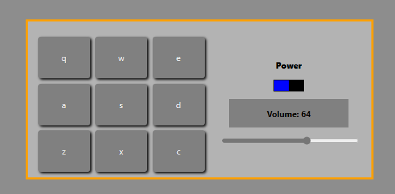

# Drum-machine

## Features

- click drum(div) to listen sound
- key events, which is displayed in the div. also trigers sound.
- You can volume up and volume down.
- You can turn off drum sounds.
- sounds are 'https://s3.amazonaws.com/freecodecamp/drums/Heater-1.mp3' and similar to this.

## Technologies used

- React
- Typescript

## installation

- clone the repository
- change directory
- npm install
- npm run dev

### Author

- luka kilasonia
- github: https://github.com/kila21
- linkedin: https://www.linkedin.com/in/luka-kilasonia-937a9a211/
